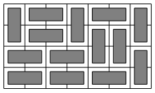

# 2181 - Counting Tilings

We use dynamic programming to solve the problem.
We represent each column pattern as a bitmask that indicates the rows
where a horizontal tile begins.
For example, consider the following tiling:



Here the bitmasks $0011$, $1100$, $0011$, $0000$, $1001$, $0000$ and $0000$
correspond to the column patterns from left to right.

A pair of bitmasks $(a,b)$ is valid if patterns $a$ and $b$ can occur
next to each other in the tiling. For example, $(0011,1100)$ is a valid
pair which corresponds to the first two columns in the example.
The pair $(0011,1101)$ is not valid, because a horizontal tile begins
in the last row in both bitmasks.

A simple solution would be to iterate over all pairs of bitmasks in every column.
There are $4^n$ bitmask pairs and checking if a pair is valid
takes $O(n)$ time, so such a solution would require $O(mn4^n)$ time.
This can be optimized by only checking pairs of bitmasks which share no bits.
There are exactly $3^n$ such bitmasks, which would result in an $O(mn3^n)$ solution.

An $O(mn3^n)$ solution can be made fast enough, but since in practice there are
much less valid transitions than $3^n$, and the same transitions are used for
each column, it makes sense to precompute them.

## Solution 1: Precomputed transitions

In this solution, the transitions are computed recursively before
performing dynamic programming, one or two bits at a time.
The bitmask `left` represents which rows have a horizontal tile going left,
and `right` represents which rows have a horizontal tile going right.
Other rows are occupied by vertical tiles, which have a height of two.

Dynamic programming values from only the previous column need to be known,
so two vectors are used and swapped between columns.

It can be shown [[2](#references)] that the number of transitions is
$O((1 + \sqrt 2)^n)$. Therefore the time complexity of this solution is $O(m(1 +
\sqrt 2)^n)$, or approximately $O(m2.42^n)$.

```cpp
#include <algorithm>
#include <iostream>
#include <vector>
using namespace std;
const int M = 1000000007;

int n;
vector<pair<int, int>> transitions;

void generate(int i, int left, int right) {
    if (i > n) return;
    if (i == n) {
        transitions.emplace_back(left, right);
        return;
    }
    generate(i + 1, left | 1 << i, right);
    generate(i + 1, left, right | 1 << i);
    generate(i + 2, left, right);
}

int main() {
    int m;
    cin >> n >> m;

    generate(0, 0, 0);

    vector<int> cur(1 << n), prev(1 << n);
    prev[0] = 1;

    for (int i = 0; i < m; ++i) {
        fill(cur.begin(), cur.end(), 0);

        for (auto [x, y] : transitions) {
            cur[y] += prev[x];
            cur[y] %= M;
        }

        swap(cur, prev);
    }

    cout << prev[0] << endl;
}
```

## Solution 2: Sum over subsets

Let us take a closer look at the transitions.

One transition that is always valid is from the bitmask $s$ to the complement of
$s$. At every position where there is not a tile going to the left, we choose a
tile going to the right. Complementing the bitmasks is equivalent to reversing
the dynamic programming array.

The other transitions from $s$ are formed by replacing some adjacent pairs of
tiles going to the right with vertical pieces.

The sum over subsets technique can be used to compute the desired sum of valid
transitions. More precisely, as the value associated with the bitmask $s$ we sum
all values of supersets of $s$ that may have some added adjacent pairs of
1-bits. The technique works similarly even with this added restriction.

The time complexity of this solution is $O(mn2^n)$. For $n=10$ it is very
similar in performance to the first solution.

```cpp
#include <algorithm>
#include <iostream>
using namespace std;
const int M = 1000000007;

int tilings[1 << 10];

int main() {
    int n, m;
    cin >> n >> m;

    tilings[0] = 1;

    for (int i = 0; i < m; ++i) {
        reverse(tilings, tilings + (1 << n));

        for (int j = 0; j < n - 1; ++j) {
            for (int s = 0; s < (1 << n); ++s) {
                if ((s & 0b11 << j) == 0) {
                    tilings[s] += tilings[s | 0b11 << j];
                    tilings[s] %= M;
                }
            }
        }
    }

    cout << tilings[0] << endl;
}
```

## References

1. [CPHB (Competitive Programmer's Handbook)](https://cses.fi/book/), Chapters 7.6 and
   10.6, Counting subsets.
2. [Pell number (Wikipedia)](https://en.wikipedia.org/wiki/Pell_number)