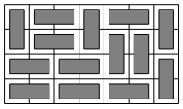

# 2181 - Đếm số cách lát gạch

Ta sử dụng quy hoạch động để giải bài toán.
Ta biểu diễn mỗi mẫu cột bằng một mặt nạ bit (bitmask) chỉ các hàng
nơi một viên gạch ngang bắt đầu.
Ví dụ, xét cách lát sau:



Ở đây các mặt nạ $0011$, $1100$, $0011$, $0000$, $1001$, $0000$ và $0000$
tương ứng với các mẫu cột từ trái sang phải.

Một cặp mặt nạ $(a,b)$ là hợp lệ nếu các mẫu $a$ và $b$ có thể xuất hiện
cạnh nhau trong cách lát. Ví dụ, $(0011,1100)$ là một cặp hợp lệ
tương ứng với hai cột đầu tiên trong ví dụ.
Cặp $(0011,1101)$ không hợp lệ, vì một viên gạch ngang bắt đầu
ở hàng cuối cùng trong cả hai mặt nạ.

Một lời giải đơn giản là duyệt qua tất cả các cặp mặt nạ trong mỗi cột.
Có $4^n$ cặp mặt nạ và việc kiểm tra một cặp có hợp lệ không
mất $O(n)$ thời gian, do đó lời giải như vậy cần $O(mn4^n)$ thời gian.
Điều này có thể được tối ưu bằng chỉ xét các cặp mặt nạ không có bit chung.
Có chính xác $3^n$ mặt nạ như vậy, dẫn đến lời giải $O(mn3^n)$.

Lời giải $O(mn3^n)$ có thể đủ nhanh, nhưng trong thực tế có ít
chuyển trạng thái hợp lệ hơn $3^n$ rất nhiều, và các chuyển trạng thái
giống nhau được dùng cho mỗi cột, nên việc tiền tính toán chúng là hợp lý.

## Lời giải 1: Chuyển trạng thái được tiền tính toán

Trong lời giải này, các chuyển trạng thái được tính đệ quy trước khi
thực hiện quy hoạch động, mỗi lần một hoặc hai bit.
Mặt nạ `left` biểu diễn các hàng có viên gạch ngang đi về bên trái,
và `right` biểu diễn các hàng có viên gạch ngang đi về bên phải.
Các hàng còn lại được lấp đầy bởi các viên gạch dọc, có chiều cao là hai.

Chỉ cần biết giá trị quy hoạch động từ cột trước đó,
nên hai vector được dùng và hoán đổi giữa các cột.

Có thể chứng minh [[2](#tài-liệu-tham-khảo)] rằng số chuyển trạng thái là
$O((1 + \sqrt 2)^n)$. Do đó độ phức tạp thời gian của lời giải này là $O(m(1 +
\sqrt 2)^n)$, xấp xỉ $O(m2.42^n)$.

```cpp
#include <algorithm>
#include <iostream>
#include <vector>
using namespace std;
const int M = 1000000007;

int n;
vector<pair<int, int>> transitions;

void generate(int i, int left, int right) {
    if (i > n) return;
    if (i == n) {
        transitions.emplace_back(left, right);
        return;
    }
    generate(i + 1, left | 1 << i, right);
    generate(i + 1, left, right | 1 << i);
    generate(i + 2, left, right);
}

int main() {
    int m;
    cin >> n >> m;

    generate(0, 0, 0);

    vector<int> cur(1 << n), prev(1 << n);
    prev[0] = 1;

    for (int i = 0; i < m; ++i) {
        fill(cur.begin(), cur.end(), 0);

        for (auto [x, y] : transitions) {
            cur[y] += prev[x];
            cur[y] %= M;
        }

        swap(cur, prev);
    }

    cout << prev[0] << endl;
}
```

## Lời giải 2: Tổng trên các tập con

Hãy xem xét kỹ hơn các chuyển trạng thái.

Một chuyển trạng thái luôn hợp lệ là từ mặt nạ $s$ sang phần bù của
$s$. Tại mọi vị trí không có viên gạch đi về bên trái, ta chọn một
viên gạch đi về bên phải. Lấy phần bù của các mặt nạ tương đương với
đảo ngược mảng quy hoạch động.

Các chuyển trạng thái khác từ $s$ được tạo thành bằng cách thay thế
một số cặp viên gạch đi về bên phải liền kề bằng các viên gạch dọc.

Kỹ thuật tổng trên các tập con (sum over subsets) có thể được dùng để
tính tổng các chuyển trạng thái hợp lệ mong muốn. Chính xác hơn, với
giá trị liên kết với mặt nạ $s$, ta tính tổng tất cả các giá trị của
các tập siêu (superset) của $s$ có thể có thêm một số cặp bit 1 liền kề.
Kỹ thuật hoạt động tương tự ngay cả với ràng buộc bổ sung này.

Độ phức tạp thời gian của lời giải này là $O(mn2^n)$. Với $n=10$ nó có
hiệu năng tương tự lời giải đầu tiên.

```cpp
#include <algorithm>
#include <iostream>
using namespace std;
const int M = 1000000007;

int tilings[1 << 10];

int main() {
    int n, m;
    cin >> n >> m;

    tilings[0] = 1;

    for (int i = 0; i < m; ++i) {
        reverse(tilings, tilings + (1 << n));

        for (int j = 0; j < n - 1; ++j) {
            for (int s = 0; s < (1 << n); ++s) {
                if ((s & 0b11 << j) == 0) {
                    tilings[s] += tilings[s | 0b11 << j];
                    tilings[s] %= M;
                }
            }
        }
    }

    cout << tilings[0] << endl;
}
```

## Tài liệu tham khảo

1. [CPHB (Competitive Programmer's Handbook)](https://cses.fi/book/), Chương 7.6 và
   10.6, Đếm tập con.
2. [Số Pell (Wikipedia)](https://en.wikipedia.org/wiki/Pell_number)
